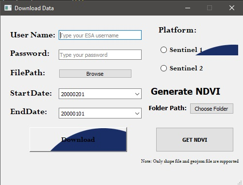

# NDVI-Index

## Introduction
This application is developed to download the Sentinel 2 imagery as well as Sentinel 1 imagery according to the provided Shape file or GeoJson file. After the image is downloaded user can also generate the NDVI index of the same image.


## Files Overview<br>
<b>Sentinelsat-Download data.py:</b> Actual Code<br>
<b>GUI1.ui:</b> UI file<br>
<b>demo_for_download.mp4:</b> Demo video for downloading the Imagery.<br>
<b>demo_for_ndvi.mp4:</b> Demo Video for Generating NDVI.<br>
<b>output:</b> Contains demo output of the code.<br>
<b>esa_logo.jpg:</b> Logo image used on the UI.<br>

## Setup
Install all the dependencies using 
```console
pip install -r req.txt
```
## Procedure to Use Application:
### To Download the Sentinel Image:
<br>
#### Steps
1) Enter the ESA Username and Password.
2) Select the path of Shp file or Geojson File from FilePath option.
3) Select the starting date and Ending date of remote sensed imagery.
4) Select the source of the image by choosing the available platform i.e either Sentinel 1 or Sentinel 2.
5) Click on Download Option to initiate the process.

### To generate the NDVI Index from Image:
#### Steps
1) Extract the Downloaded image file from ZIP.
2) Select the folder path.
3) Click on GET NDVI button to initiate the process. Output image is displayed on the screen and also saved on the output folder.

### Output Image:
<br>